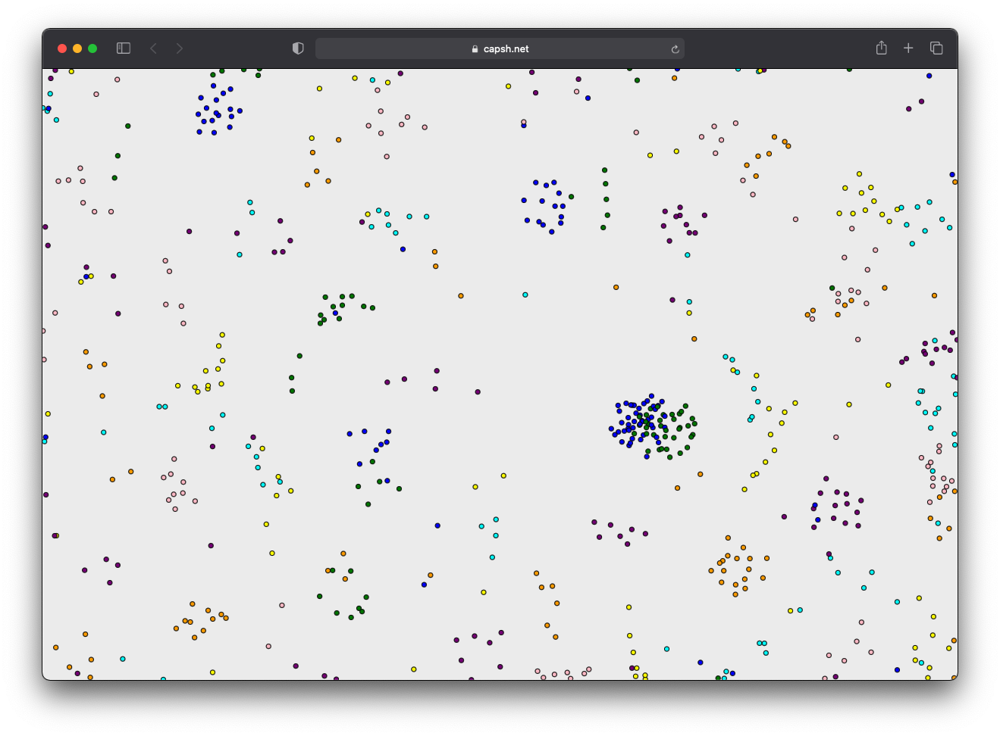

# Particles
## An experiment simulating particles in a 2D space

This is the first version of a fun experimental toy. [Check it out here.](https://capsh.net/particles/) I'm not intending to make it too robust, understandable, or extensible. This was inspired by a YouTube video created by the maker of [https://particle-life.com/](https://particle-life.com/) though the implementation was not derived from that project in any way.

This simulation uses made-up abstractions—sometimes inspired by gravity, sometimes inspired by electromagnetism, and sometimes just made up for effect—to simulate particles of different color interacting with each other on the canvas. From various attraction weights, interesting emergent behavior can arise. 

### Potential features to add

- Enabling particle attraction configuration
- Non-homogenous environments (walls, elevation, etc.)
- Transformations of particles (A + B yields C)
- Polarity
- Chemistry
- - Bonds
- - Heat
- - Reactions
- Death / war